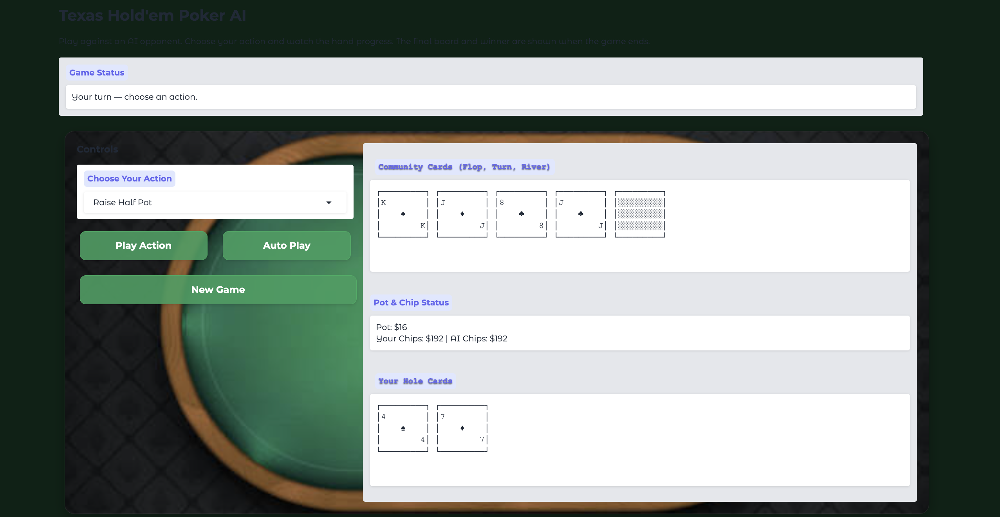

# Poker Better — Deep Q-Learning Texas Hold'em Agent

## Overview
This project implements a **Texas Hold'em No Limit** poker agent trained with **Deep Q-Learning (DQL)** using the [PettingZoo](https://pettingzoo.farama.org/) multi-agent environment.  
The AI can play against other trained agents or humans, make strategic betting decisions, and adapt to evolving game states.

Key highlights:
- **Neural Network Architecture** — Combines a **LSTM** to process sequential game states with a **Fully Connected Network** for reward prediction.
- **Replay Buffer & Epsilon-Greedy Policy** — Ensures stable learning and exploration/exploitation balance.
- **Modular Codebase** — Training, environment setup, models, and utilities are split into separate files for clarity and reuse.
- **Hand Visualization** — Cleanly formatted hole and community card display for easy interpretation.

